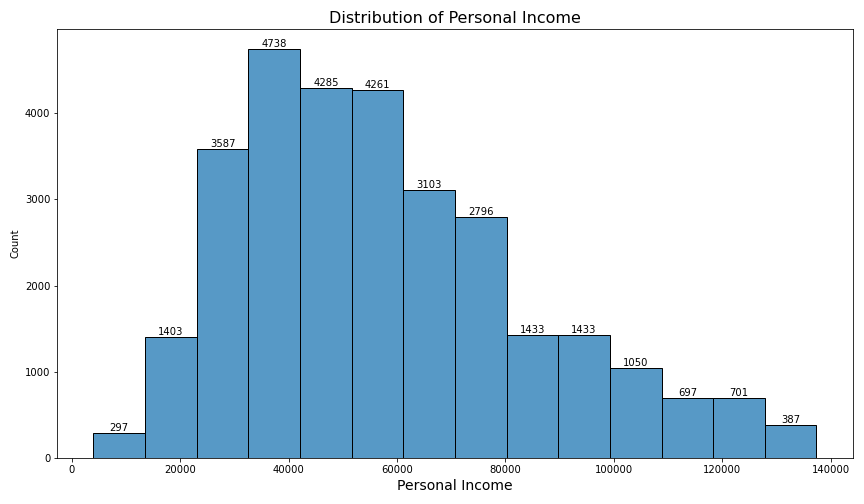
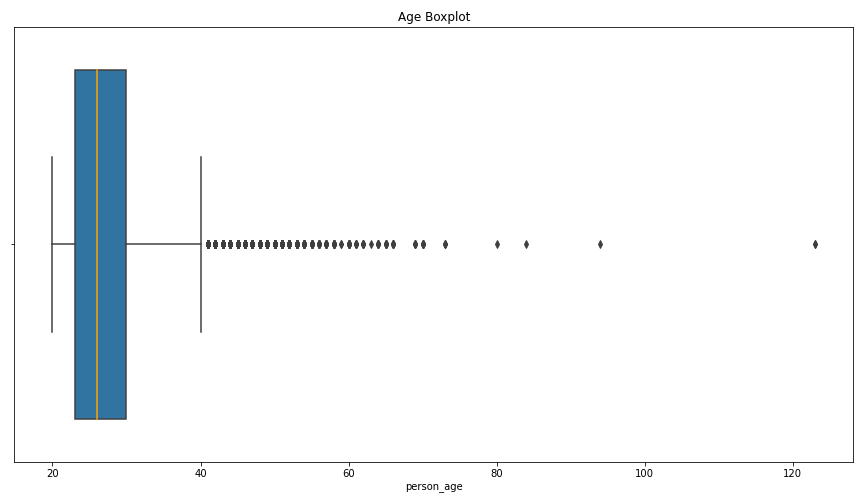
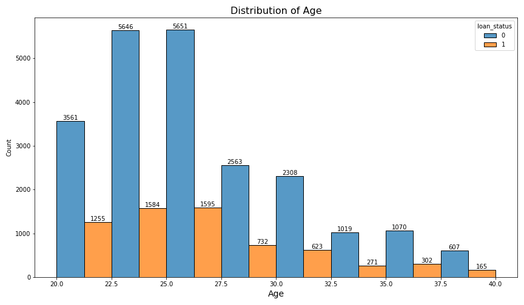
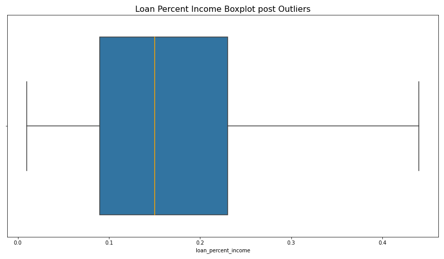
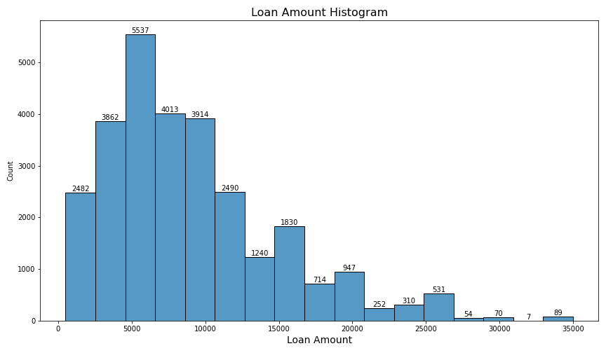
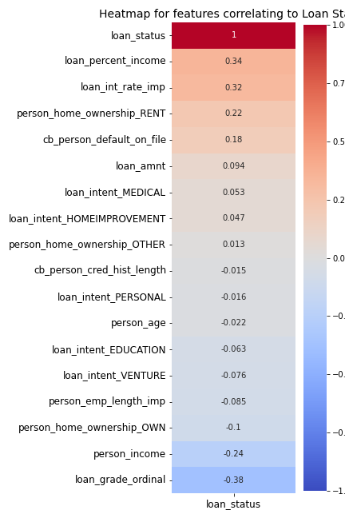

# Credit Risk Analysis

## Problem Statement

How would you improve the bank's existing state-of-the-art credit scoring of borrowers? How will you predict someone can face financial distress in the next couple of years?
* Think about how we gauge financial distress from a banking perspective?  Can we predict whether a borrower will default or not?
* What features most heavily contribute to whether a client will default or not?

## Dataset

This is simulated credit bureau data taken from kaggle here : [Kaggle Simulated Credit Bureau Data](https://www.kaggle.com/datasets/laotse/credit-risk-dataset).

### Data Dictionary
| Feature Name               | Description                                                   |
|----------------------------|---------------------------------------------------------------|
| person_age                 | Age                                                           |
| person_income              | Annual income                                                 |
| person_home_ownership      | Home Ownership Status                                         |
| person_emp_length          | Length of employment (years)                                  |
| loan_intent                | Loan Intent                                                   |
| loan_grade                 | Loan Grade                                                    |
| loan_amnt                  | Loan amount                                                   |
| loan_int_rate              | Interest Rate                                                 |
| loan_status                | If person has defaulted or not (0 = non-default, 1 = default) |
| loan_percent_income        | Loan as percent of income                                     |
| cb_person_default_onfile   | If person has defaulted in the past                           |
| cb_person_cred_hist_length | Credit History Length                                         |

### Data Cleaning & Processing

* Fill in null values for employment length (895) and loan interest rate(3116) using Iterative Imputer.
* Deal with outliers using box plots & applying interquartile range calculations.
* For example, employment length beyond 14.5 years is an outlier based on statistical methods.
* Ordinal encode ranked categorical data, in this case the loan grade data.  A, B, C, etc is turned into  6,5,4, etc.
* Default on File column gets turned into numerical(From yes & no to 1 & 0)
* Rest of the categorical data undergoes get_dummies, which is a fancy way of making the data numerically encoded.

## Data Visualizations & Analysis

Great way to see if there is anything out of the ordinary;
* Max  age of 144 & employment length of 123 are a few of the things that do not add up.

### Histogram Overview

* Most people in the data set are in between their 20s and 30s
* Most people stay at a job for less than 10 years.
* Most of the population has a loan amount of between 5,000 to 10,000
* Most of the people in the distribution have a loan to income percent of less than 25 %.

### Employment length

* Right skewed heavily due to what appears to be outliers reaching past the 120 year mark.

* Clear outliers occur from about the 20 year mark on, interquartile range calculations can give us a specific threshold by which to eliminate them.

")
* Post dealing with outliers the cutoff is 14 years.

* As we drill down by employee length and loan status, we see both frequency of both populations go down over time at the same about the same proportional rate.
### Personal Income(Annual)

* Regarding income we can see the economic disparities and the outliers exist by several orders of magnitude.

* Boxplot gives us a good look at the median income being about 55k

* The data appears to be multimodal and right skewed
* Along with the boxplot we can see that most people in the data set make between 30k and 75k

* When looking at the income distribution and breaking down by loan status, we see a sharp decrease in loan defaults for incomes over 80k.
* Highest defaults occur for incomes between 20 and 40k.
* Overall there appears to be more people that did not default overall at each income level, with the exception of those making less than 20K.

### Age

* This also has a right skew due to ages going past 120.

* Box plot shows the age cutoff should be 40.5

* Shows that both populations have an overall decrease as the age increases.
* However, after age 35 those that default become a bigger portion of the overall population.

### Loan Percent Income

* The population whose loan percent income exceeds .3 is dominated by those that default over loans over those that do not.

### Loan Amount

## Relationships with our Target Variable Loan Status

**Top 3 correlated features are:**
* Loan percent of Income
* Loan Interest rate
* Person is renting
In other words if your percentage of income is higher, your interest rates are higher, and you are a renter you are more likely to default.

**On the other side of the spectrum:**
* Loan grade (Loan grade of A = 6, B = 5, C = 4, etc)
* Personal Income
* Person owns a home
These features indicate that the better your loan grade, the higher your income, and if you are a home owner will make you less likely to default

* As "Loan amount" and "loan as a percent of income" increase there is more variability in the observed data,
* However, when you filter for whether those people defaulted, you can see the cluster of defaults as soon as the loan percent of income is greater than .15 and loan amount increases.

* Once again the way the data fans out shows variability as income and loan amount increase
* When filtering by loan status we can see that incomes lower than 20k default more.
* Incomes of less thank 50k and loan amounts between 20k and loan amounts between about 7k & 17k also show a cluster of loan defaults as well.

* You have a concentration of people defaulting when there is low income(<20k) and high loan percent income.
* Followed by the area where income is between 20k and 80k but loan percent income is between .03 and .04.

* Across loan_grades we can see the common trend that "the median loan as a percent of income" is always higher for those that default on their loans than those who do not.
* Loan grades D, E & F have a closer loan as a percent of income, but it shows that once it crosses that .2 mark they are more likely to default.
* Loan Grade G shows a median loan percent of income of about .28 and everyone in this category has defaulted.
* Outliers in the sense that for every loan grade, only a few do not default on their loans when the loan percent income is over .35.

* For all loan grades, higher incomes tend to determine whether a person will default or not.
* All grade G loan borrowers have defaulted, even as they had a median income of 60k

* Better Loan grades will have lower interest rates.

## Modeling Phase

* Shows us the dataset is imbalanced in terms of loan status. 78.5% of the data set's loan status has not defaulted.
* An imbalanced data set will guide what metrics we use since accuracy will not be as important.

### Modeling Selection
* Will utilize and compare Logistic Regression, Random Forest, and XGBoost.
* Will use scikit-learn’s grid search and pipeline modules in order to automate and tune for best parameters.
* Use precision, recall and AUC scores to drive my model selection.

### Modeling Performance

| Model               | Precision | Recall | F1 Score | AUC Score |
|---------------------|-----------|--------|----------|-----------|
| Logistic Regression | .70       | .14    | .23      | .75       |
| Random Forest       | .95       | .71    | .81      | .93       |
| **XGBoost**             | .95       | **.72**    | .82      | **.95** |

### XGBoost Confusion Matrix

* True Negative: 5575
* False Positive: 50
* False Negative: 407
* True Positive: 1054

### Metrics
* Precision indicates your true positives(those predicted positive and true) over the Total predicted positives(true positive + false positive).
* Recall measures those true positives over the total actual positives(true positive & false negative).
* In this instance a false negative, which in this case would mean being wrong about a person not defaulting, would open yourself to losses. Therefore, it is wise to look to Recall/Sensitivity.
* **Recall/Sensitivity answers the question "among those who will default, how many did I get correct?" XGBoost is correct 72% of the time.**
* **Precision answers the question "Among those I predicted will default, how many did i get correct?" XGBoost is correct 95% of the time.**
* XGBoost has the highest Recall, Precision and AUC Score which makes it our strongest model in terms of predicting whether someone can withstand financial hardship/whether they will default on their loan.

* ROC Curve is generated by varying threshold from 0 to 1.  Which helps visualize the tradeoff between sensitivity and specificity and helps us understand how well-separated our populations are.
* When evaluating ROC AUC, the closer to 1 indicates the best model.  With this in mind XGBoost outperforms the RandomForest model by a slim margin of .2. A score closer to 1 indicates a good separation of our postive and negative populations.  
* Logistic Regression trails by .20 and is closer to that .5 threshold which would make the model closer to having positive and negative populations overlapping. Which is bad.

The XGBoost models top 5 predictive features were as follows:
* Loan grade
* Home Ownership Status as Rent
* Loan Percent Income
* Loan for medical purposes
* Loan for home improvement

## Conclusions

Circling back to our problem statement, improving the state of the art credit scoring of borrowers entails really maximizing your current features.
* We maximizing by cleaning the data in ways such as dealing with null values, and outliers.
* Process the data so we can take advantage of our categorical columns, so we encode or dummify them accordingly.
* Getting a sense of the data through aggregations & visualizations.

* The next step to address is predicting if someone can face that financial distress, which through our target variable (loan status) we could use our features to build predictive classification models.
* We were able to use pipelines & gridsearch modules to build finely tuned logistic regression, RandomForest and XGBoost models.
* We determined that because our dataset was imbalanced; precision, recall & AUC scores were the best way to assess our models.
* XGBoost achieved the highest in those key metrics.
* We were able to see the top five features that contributed to this particular model.

## Next Steps
Would love to feature engineer based on some conditionals I may have found through visualizations and see if those improve the models.
