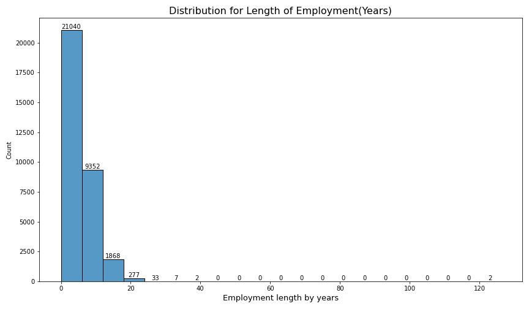

# Credit Risk Analysis

## Problem Statement

How would you improve the bank's existing state-of-the-art credit scoring of borrowers? How will you predict someone can face financial distress in the next couple of years?
* Think about how we gauge financial distress from a banking perspective?  Can we predict whether a borrower will default or not?
* What features most heavily contribute to whether a client will default or not?

## Dataset

This is simulated credit bureau data taken from kaggle here : [Kaggle Simulated Credit Bureau Data](https://www.kaggle.com/datasets/laotse/credit-risk-dataset).

### Data Dictionary
| Feature Name               | Description                                                   |
|----------------------------|---------------------------------------------------------------|
| person_age                 | Age                                                           |
| person_income              | Annual income                                                 |
| person_home_ownership      | Home Ownership Status                                         |
| person_emp_length          | Length of employment (years)                                  |
| loan_intent                | Loan Intent                                                   |
| loan_grade                 | Loan Grade                                                    |
| loan_amnt                  | Loan amount                                                   |
| loan_int_rate              | Interest Rate                                                 |
| loan_status                | If person has defaulted or not (0 = non-default, 1 = default) |
| loan_percent_income        | Loan as percent of income                                     |
| cb_person_default_onfile   | If person has defaulted in the past                           |
| cb_person_cred_hist_length | Credit History Length                                         |

## Data Visualizations & Analysis

Great way to see if there is anything out of the ordinary;
* Max  age of 144 & employment length of 123 are a few of the things that do not add up.

### Histogram Overview

* Most people in the data set are in between their 20s and 30s
* Most people stay at a job for less than 10 years.
* Most of the population has a loan amount of between 5,000 to 10,000
* Most of the people in the distribution have a loan to income percent of less than 25 %.

### Employment length

* Right skewed heavily due to what appears to be outliers reaching past the 120 year mark.

* Clear outliers occur from about the 20 year mark on, interquartile range calculations can give us a specific threshold by which to eliminate them.

")
* Post dealing with outliers the cutoff is 14 years.

* As we drill down by employee length and loan status, we see both frequency of both populations go down over time at the same about the same proportional rate.
### Personal Income(Annual)

